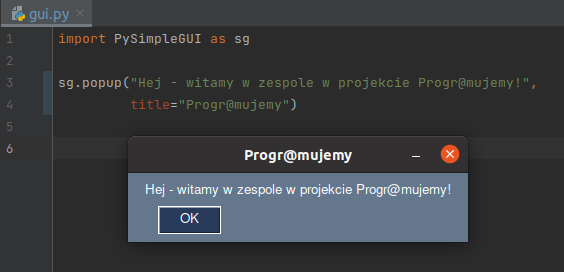

# Scenariusz/instrukcja lekcji dla nauczycieli

Temat: Spotkanie 1 - start, przygotowanie środowiska

Autor: **Adam Jurkiewicz**

Licencja: CC BY-SA 4.0 - https://creativecommons.org/licenses/by-sa/4.0/deed.pl

#### Opis ogólny:
> W trakcie tego spotkania  skupiamy się na przygotowaniu środowiska pracy, a więc na koncie w serwisie GitHub
---

## Podstawowe treści omawiane w materiale:

- licencje na oprogramowanie
- PyCharm i prosty projekt programistyczny
- serwis GitHub - współpraca wielu osób nad projektem
- serwisy z darmowymi materiałami graficznyi
- Writer - edytor tekstów
- GIMP - edytor grafiki
- Bluefish - edytor HTML

---

## Przebieg lekcji

### Czynności przygotowawcze przed lekcją:

1. Przygotowanie do zajęć. Należy zweryfikować działanie VirtualBox na komputerach szkolnych - ***to krytyczne dla
   powodzenia projektu***.
2. Warto zapoznać się z filmami przed pierwszymi zajęciami.
3. W szczególności zalecamy filmy **a02, a03, a04** - aby przetestować działanie aplikacji i być gotowym na ewentualne
   problemy uczniów, np. literówki

### Faza wstępna:

1. Rozpoznanie wiedzy uczniów. Warto podyskutować chwilę o ich znajomości serwisu GitHub i o tym, jak wykorzystują je
   firmy do wspólnej pracy programistów.

### Faza realizacyjna:

1. #### Konfiguracja IDE PyCharm, tworzenie konta w GitHub.com

Z uwagi na fakt, że w `OVA` w VirtualBox wszystko już jest zainstalowane, uczniowie tylko zakładają sobie konta na
GitHub. Tę czynność w ogóle można zlecić do wykonania samodzielnie w domu *przed zajęciami*.

2. #### Przygotowujemy środowisko `venv` dla lokalnego projektu

Tu wystarczy pokazać film i postępować zgodnie ze wskazówkami.

3. #### Plik `requirements.txt` - zewnętrzne moduły, własne pliki `py` w projekcie

Tu wystarczy pokazać film i postępować zgodnie ze wskazówkami. Zwracamy uwagę na zewnętrzne moduły - można pokazać
stronę https://pypi.org/ (to repozytorium zewnętrznych bibliotek do Pythona, np.: https://pypi.org/project/PyTechBrain/)

4. #### Minimalny program z wykorzystaniem PySimpleGUI

Tu wystarczy pokazać film i postępować zgodnie ze wskazówkami. Uczniowie testowo wykonują lokalne środowisko virtualenv
w PyCharm i tam dla testów wykonują bardzo prostą aplikację:



```python
import PySimpleGUI as sg

sg.popup("Hej - witamy w zespole w projekcie Progr@mujemy!",
         title="Progr@mujemy")
```

5. #### Skąd będziemy czerpać grafiki? Pixabay, Freepik i Flaticon.

Tu wystarczy pokazać film i postępować zgodnie ze wskazówkami. Możemy przypomnieć o licencjach, zgodnie z zapisami
podstawy programowej uczniowie mają rozróżniać różne licencje.

6. #### Uruchamiamy edytor tekstów - format strony.

Tu wystarczy pokazać film i postępować zgodnie ze wskazówkami. Możemy przypomnieć o licencjach, zgodnie z zapisami
podstawy programowej uczniowie mają rozróżniać różne licencje.

7. #### Uruchamiamy edytor grafiki - otwieramy przykładowy plik graficzny.

Tu wystarczy pokazać film i postępować zgodnie ze wskazówkami. Możemy przypomnieć o licencjach, zgodnie z zapisami
podstawy programowej uczniowie mają rozróżniać różne licencje.

8. #### Uruchamiamy edytor HTML - podstawowa strona z szablonu.

Tu wystarczy pokazać film i postępować zgodnie ze wskazówkami. Możemy przypomnieć o licencjach, zgodnie z zapisami
podstawy programowej uczniowie mają rozróżniać różne licencje.

9. #### Edytor HTML: Bootstrap - https://getbootstrap.com/

Tu wystarczy pokazać film i postępować zgodnie ze wskazówkami. Przypomnijmy, jak wiele oprogramowania jest tworzonego na
otwartych licencjach, np.: https://github.com/twbs/bootstrap/blob/v5.0.2/LICENSE
> The MIT License (MIT)
>
> Copyright (c) 2011-2021 Twitter, Inc.
>
> Copyright (c) 2011-2021 The Bootstrap Authors
>
> Permission is hereby granted, free of charge, to any person obtaining a copy of this software and associated documentation files (the "Software"), to deal in the Software without restriction, including without limitation the rights to use, copy, modify, merge, publish, distribute, sublicense, and/or sell copies of the Software, and to permit persons to whom the Software is furnished to do so, subject to the following conditions:
>
>The above copyright notice and this permission notice shall be included in all copies or substantial portions of the Software.
>
>THE SOFTWARE IS PROVIDED "AS IS", WITHOUT WARRANTY OF ANY KIND, EXPRESS OR IMPLIED, INCLUDING BUT NOT LIMITED TO THE WARRANTIES OF MERCHANTABILITY, FITNESS FOR A PARTICULAR PURPOSE AND NONINFRINGEMENT. IN NO EVENT SHALL THE AUTHORS OR COPYRIGHT HOLDERS BE LIABLE FOR ANY CLAIM, DAMAGES OR OTHER LIABILITY, WHETHER IN AN ACTION OF CONTRACT, TORT OR OTHERWISE, ARISING FROM, OUT OF OR IN CONNECTION WITH THE SOFTWARE OR THE USE OR OTHER DEALINGS IN THE SOFTWARE.

### Faza podsumowująca:

1. Nauczyciel może podsumować wykonane zadanie, uczniowie mogą sprawdzić zawartość katalogu wirtualnego środowiska
   Python dla swojego projektu.
2. Do obejrzenia i samodzielnej pracy przeznaczone są w tym momencie następujące filmy:
   1. #### VirtualBox w Windows i jak importować maszynę `OVA` - aby pracować niezależnie od szkoły
   2. #### PySimpleGui - dokumentacja, przykłady użycia
   3. #### Edytor teskstów: nagłówek i stopka
   4. #### Edytor teskstów: style i spis treści
   5. #### Edytor grafiki: zmiana rozmiaru i zapis XCF
   6. #### Edytor HTML:  różne znaczniki `meta`

----

## Kształtowane kompetencje kluczowe:

- kompetencje obywatelskie,
- kompetencje cyfrowe,
- kompetencje osobiste, społeczne i w zakresie umiejętności uczenia się,
- kompetencje matematyczne oraz kompetencje w zakresie nauk przyrodniczych, technologii i inżynierii.

## Cele operacyjne (językiem ucznia):

- Poznasz różne aplikacje
- Powtórzysz wiedzę o licencjach na materiały i oprogramowanie

## Metody i techniki nauczania:

- dyskusja,
- rozmowa nauczająca z wykorzystaniem multimedium i ćwiczeń interaktywnych,
- ćwiczenia praktyczne.

## Formy pracy:

- praca indywidualna,
- praca całego zespołu klasowego.

## Środki dydaktyczne:

- komputery z głośnikami, słuchawkami i dostępem do internetu,
- zasoby multimedialne zawarte w e‑materiale,
- tablica interaktywna/tablica, pisak/kreda,
- oprogramowanie dla języka Python 3 (lub nowszej wersji), w tym PyCharm Community Edition.
- oprogramowanie VirtualBox i `OVA` z systemem Linux i aplikacjami Writer, GIMP, Bluefish

## Materiały pomocnicze:

- Oficjalna dokumentacja techniczna dla języka Python 3 (lub nowszej wersji), dostępna pod
  adresem: [3.10.2 Documentation](https://docs.python.org/).
- Dokumentacja wyboru licencji: https://creativecommons.pl/wybierz-licencje/

## Wskazówki metodyczne:

- można wskazać na różne rodzaje licencji różnych systemów operacyjnych i samego Pythona w kontekście prawa autorskiego.
- warto położyć duży nacisk na licencje CreativeCommons (https://creativecommons.pl)

