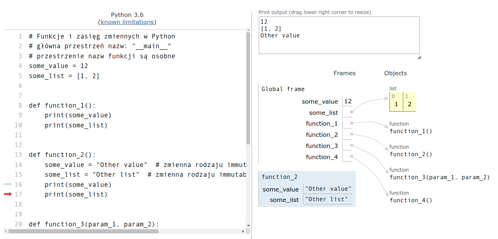

# Scenariusz zajęć

## **rozwijamy umiejętność współpracy w zespole w trakcie zadania programistycznego**

> Ten wstęp opisuje najważniejsze elementy związane z naszą propozycją prowadzenia warsztatów. Zakładamy pewien podział materiałów, ale każdy nauczyciel może wg własnego uznania podzielić te materiały inaczej, jeśli uzna to za stosowne w ramach swoich grup.

---

**Obszar tematyczny:** informatyka

**Etap edukacyjny:**

Zajęcia zaplanowano dla uczniów klas II-III liceów ogólnokształcących, uczęszczających do klas z rozszerzonym programem z zakresu informatyki, a także dla uczniów klas II-IV techników, uczących się w zawodzie technik-informatyk lub technik programista. Nie ma również przeciwwskazań, abyście zastosowali scenariusz w odniesieniu do uczniów klas I szkół średnich pod warunkiem, że będą oni posiadali niezbędną wiedzę i umiejętności z zakresu programowania, minimalnie:

- podstawowa wiedza o konstrukcjach programistycznych
- znajomość jakiegokolwiek języka programowania tekstowego (C; Pascal; LOGO; BASIC; JavaScript; itp.) lub znajomość Python na poziomie podstawowym

Dodatkowo przydatna będzie znajomość języka angielskiego na poziomie średnim (konieczność czytania dokumentacji technicznej w języku angielskim, choć można korzystać z serwisów tłumaczących).

**Informacje organizacyjne:**

Grupa uczestników (klasa) podzielona zostanie na grupy 4-osobowe (ostatnia grupa między 2 a 5 os.) na podstawie przeprowadzonego na wcześniejszych zajęciach (lekcja “0”) prostego testu predyspozycji i ról w zespole.

Poziom zaawansowania uczniów w zakresie znajomości języka Python: podstawowy. Zakładamy w naszych samouczkach podstawowy poziom znajomości zagadnień związanych z programowaniem w ww. języku, ale młodzież może do niego dojść samodzielnie, bazując na ogólnodostępnych kursach, np.:

- Podstawowy: https://it-szkola.edu.pl/kkurs,kurs,216 wraz z kodami w serwisie GitHub: https://github.com/klubmlodegoprogramisty/python/tree/main/poziom_podstawowy
- Średnio zaawansowany: https://it-szkola.edu.pl/kkurs,kurs,217 wraz z kodami w serwisie GitHub: https://github.com/klubmlodegoprogramisty/python/tree/main/poziom_sredniozaawansowany

---

**Treści nauczania:**

Tematyka i program zajęć odwołują się do podstawy programowej z rozszerzonego zakresu informatyki:

1. programowanie i rozwiązywanie problemów z wykorzystaniem komputera oraz innych urządzeń cyfrowych: układanie i programowanie algorytmów, organizowanie, wyszukiwanie i udostępnianie informacji, posługiwanie się aplikacjami komputerowymi (cel kształcenia nr II);
2. rozwijanie kompetencji społecznych, takich jak: komunikacja i współpraca w zespole, w tym w środowiskach wirtualnych, udział w projektach zespołowych oraz zarządzanie projektami (cel kształcenia nr IV).

#### Realizujemy działania w oparciu o 3 przykładowe projekty:

1. Lokalizacje lotów samolotów: https://aviationstack.com (w filmach są przykłady z tego projektu)
2. Weryfikacja firm dla numerów telefonów: https://numverify.com
3. Alert pogodowy dla 3 dniowej prognozy: https://wttr.in/

> Oczywiście, każdy zespół może sobie wybrać dowolny inny projekt (inne API, inne funkcjonalności).
> Ważne, aby zachować układ: aplikacja, dokumentacja, strona internetowa o produkcie.
> Najsłabsi mogą skorzystać z projektu Lokalizacji lotów samolotów, ważny jest proces budowania aplikacji,
> aby młodzież nauczyła się współpracy w zespole. Najbardziej kreatywni mogą zaś dowolnie kształtować wykonywane przez siebie projekty - nie ograniczajmy ich, nawet, jeśli przewyższają nas wiedzą techniczną - a zwłaszcza wtedy dajmy im sporą swobodę w działaniu. Możemy być zadzwieni ich kreatywnością.

##### Wybór projektu dla aplikacji może nastąpić po lekcji 3, kiedy w trakcie samodzielnej pracy uczniowie mogą sprawdzić różne API, lub zespoły mogą pozostać przy jednej z trzech naszych propozycji.

---

#### 

**Cele edukacyjne dla uczniów (efekty uczenia się):**

Dzięki uczestnictwu w zajęciach w zakresie kompetencji programistycznych uczeń:

1. (*Wiedza*)

2. 1. zna podstawowe zasady efektywnej komunikacji interpersonalnej;
   2. wie jakie czynniki determinują sukces w pracy zespołu;
   3. umie wykorzystać ogólnodostępne API;
   4. wie jak posługiwać się środowiskiem programistycznym PyCharm;
   5. potrafi odróżnić różne elementy języka programowania.

3. (*Umiejętności*)

4. 1. potrafi sformułować klarowny komunikat i sprawdzić czy został on właściwie zrozumiany;
   2. radzi sobie z sytuacją konfliktową w zespole;
   3. potrafi korzystać z serwisu GitHub do współpracy z innymi programistami;
   4. radzi sobie z systemem operacyjnym Linux;
   5. realizuje obiektowe paradygmaty programowania.

5. (*Postawy / kompetencje społeczne*)

6. 1. zachowuje się odpowiedzialnie w stosunku do pozostałych członków zespołu i wywiązuje się z własnych zobowiązań, mając na celu osiągniecie wspólnego celu zespołu;
   2. reaguje ciekawością na odmienne opinie i poglądy, rozwiązując konflikty w trybie porozumienia;
   3. traktuje inne osoby z szacunkiem dla ich odmienności;
   4. komunikuje się w sposób klarowny, wykorzystując narzędzia efektywnej komunikacji interpersonalnej;
   5. zyskuje świadomość swoich własnych zasobów: umiejętności, talentów i  mocnych stron.

**Czas trwania (liczba godzin): 7 h lekcyjnych (zajęcia szkolne) + 5 h zegarowe (praca po zajęciach)**

- 1 x 45 na zajęcia wprowadzające, zawarcie kontraktu z uczniami oraz wyjaśnienie zasad, jakie będą obowiązywać w trakcie zajęć, oraz ról pełnionych przez nauczyciela i uczniów, podział grupy na zespoły, wybór tematu projektu zespołowego, pre-test kompetencji współpracy i komunikacji w zespole
- 5 x 45 minut zajęć stricte programistycznych
- 5 x 60 minut zajęć samodzielnych (w ramach stworzonego zespołu)
- 1 x 45 minut spotkania podsumowującego, końcowy test kompetencji współpracy i komunikacji w zespole

**Podział materiału na lekcje i pracę w domu - nasza propozycja:**

1. Lekcja w szkole - podział, tematy itp... wstęp
2. Lekcja w szkole - ustawienia wstępne środowiska
   * Praca samodzielna - maszyna wirtualna i podstawy aplikacji
3. Lekcja w szkole - podstawowe typy danych i konstrukcje programistyczne w Python
   * Praca samodzielna - obsługa głównych elementów biblioteki PySimpleGUI
4. Lekcja w szkole - requests i API - słowniki i JSON
   * Praca samodzielna - samodzielne testy dostępu do API
5. Lekcja w szkole - różne interfejsy aplikacji, `Commit/Push` do repozytorium
   * Praca samodzielna - definiowanie funkcji w Python i dalsze przygotowywanie dokumentacji
6. Lekcja w szkole - praca z kluczami i wartościami słowników
   * Praca samodzielna - końcowe tworzenie dokumentacji
7. Lekcja w szkole - podsumowanie projektów, wybór najlepszego projektu, post-testy itp.

*Pamiętamy, aby po każdej lekcji w szkole (od lekcji 5) lub pracy samodzielnej uczestnicy zaktualizowali swoje
repozytoria poprzez `Commit/Push`*

 **Metody i formy pracy:**

- metoda podawcza (wprowadzenie + filmy wspomagające)
- metoda projektu (praca w zespołach w czasie lekcji i pozalekcyjna)
- lekcja odwrócona (znaczna część materiału będzie przyswajana w domu, zaś praca nad projektem zespołowym w dużej mierze ma odbywać się podczas zajęć szkolnych)


**Środki dydaktyczne:**

- filmiki (pigułki wiedzy)
- krótki przewodnik po zajęciach dla uczniów 
- przykładowe kody źródłowe na platformie GitHub
- scenariusze (instrukcje) lekcyjne wspomagające nauczycieli
- przewodnik po kompetencjach współpracy i komunikacji w zespole dla nauczycieli
- testy wspomagające realizację zajęć (p. przebieg zajęć).

**Wymagania techniczne:**

*Do prowadzenia zajęć niezbędne są:*

- *komputery z procesorem minimum Core i3, 8 GB RAM dla uczestnika zajęć;* **nie można**

*przeprowadzić zajęć z wykorzystaniem tabletów/smartfonów*

- *system operacyjny: Linux lub MacOS lub MS-Windows*
- *zainstalowane oprogramowanie PyCharm Community oraz Python w wersji min. 3.8 (oba to Open Source dostępne na wszystkie systemy operacyjne)*
- *połączenie z siecią Internet łączem min. 100 MBit (w praktyce - dowolnym połączeniem zapewniającym płynne odtwarzanie wideo dla celów pokazu)*
- *projektor/monitor oraz nagłośnienie niezbędne do odtwarzania wybranych odcinków wideotutorialu przez nauczyciela w trakcie zajęć* 

W celu unifikacji i ułatwienia pracy przygotowaliśmy kompletny system operacyjny Linux Ubuntu 20.04 LTS w wersji maszyny wirtualnej `OVA` dla środowiska Virtualbox. Przed rozpoczęciem zajęć na wszystkich komputerach należy zainstalować **Virtualbox** oraz zaimportować do niego maszynę `OVA` - poniżej lista kroków do wykonania:

- ze strony https://www.virtualbox.org/wiki/Downloads należy pobrać i zainstalować Virtualbox w wersji 6 odpowiedniej
  dla używanego w szkole systemu operacyjnego, przykładowo: dla systemu Windows może to
  być https://download.virtualbox.org/virtualbox/6.1.32/VirtualBox-6.1.32-149290-Win.exe i zainstalować w systemie
- ze strony https://tinyurl.com/popo-ova pobrać plik `linux_ubuntu.ova` i zapisać na dysku (**UWAGA - plik ma ok. 7
  GB !!**)
- w środowisku **Virtualbox** wykonać **Import maszyny OVA**
- po sprawdzeniu poprawności uruchamiania systemu można usunąć plik `linux_ubuntu.ova`

Nasz projekt oparliśmy o programowanie w języku `Python 3.8` z wykorzystaniem dodatkowych
bibliotek (`PySimpleGUI, requests`), które są ogólnodostępne. Stworzona aplikacja będzie możliwa do uruchomienia tylko na komputerze z zainstalowanym minimum `Python 3.6`. Dodatkowo wykorzystujemy też inne aplikacje, wszystkie na otwartych licencjach:

- edytor tekstów Libre Office Writer (https://libreoffice.org)
- edytor grafiki GIMP (https://gimp.org)
- edytor HTML Bluefish (https://bluefish.openoffice.nl)

W systemie, który jako `OVA` przygotowaliśmy w celu prostego prowadzenia zajęć, wszelkie aplikacje są już zainstalowane i skonfigurowane.

**Przebieg zajęć:**

Zajęcia poprzedza spotkanie nauczyciela z uczniami podczas lekcji 0, która ma na celu wprowadzenie uczniów w kontekst zajęć, ich cele, planowany przebieg, a także przekazanie źródeł, na podstawie których uczniowie powinni przygotować się do zajęć (przewodnik dla uczniów, materiały wideo), przeprowadzenie dwóch testów: prostego testu predyspozycji i ról w zespole służącego przygotowaniu podziału na zespoły oraz testu umiejętności współpracy i komunikacji w zespole, który stanowił będzie punkt odniesienia dla oceny nabycia kompetencji społecznych w wyniku przeprowadzonych zajęć. Pomiędzy lekcją 0 i lekcją 1 nauczyciel przeprowadza podział na zespoły na podstawie przeprowadzonego wcześniej testu predyspozycji, swojej znajomości poziomu zaawansowania uczniów oraz wg parytetu płci. Informacja o podziale na zespoły jest przekazywana uczniom co najmniej na 1 dzień przed rozpoczęciem właściwych zajęć.


----

# Scenariusz/instrukcja lekcji dla nauczycieli

Temat: Spotkanie 1 - start, przygotowanie środowiska

Autor: **Adam Jurkiewicz**

Licencja: CC BY-SA 4.0 - https://creativecommons.org/licenses/by-sa/4.0/deed.pl

#### Opis ogólny:

> W trakcie tego spotkania skupiamy się na przygotowaniu środowiska pracy, a więc na koncie w serwisie GitHub.
> Dodatkowo młodzież pozna różnego rodzaju licencje na materiały i oprogramowanie, oraz co najważniejsze - stworzy swój pierwszy program
> w Pythonie - zgodnie z zasadą szybkich efektów pracy, aby nie zniechęcić się na początku.

---

## Podstawowe treści omawiane w materiale:

- licencje na oprogramowanie
- PyCharm i prosty projekt programistyczny
- serwis GitHub - współpraca wielu osób nad projektem
- serwisy z darmowymi materiałami graficznymi
- Writer - edytor tekstów
- GIMP - edytor grafiki
- Bluefish - edytor HTML

---

## Przebieg lekcji

### Czynności przygotowawcze przed lekcją:

1. Przygotowanie do zajęć. Należy zweryfikować działanie VirtualBox na komputerach szkolnych - ***to krytyczne dla
   powodzenia projektu***.
2. Warto zapoznać się z filmami przed pierwszymi zajęciami.
3. W szczególności zalecamy filmy **a02, a03, a04** - aby przetestować działanie aplikacji i być gotowym na ewentualne
   problemy uczniów, np. literówki

### Faza wstępna:

1. Rozpoznanie wiedzy uczniów. Warto podyskutować chwilę o ich znajomości serwisu GitHub i o tym, jak wykorzystują je
   firmy do wspólnej pracy programistów.

### Faza realizacyjna:

1. #### Konfiguracja IDE PyCharm, tworzenie konta w GitHub.com

Z uwagi na fakt, że w `OVA` w VirtualBox wszystko już jest zainstalowane, uczniowie tylko zakładają sobie konta na
GitHub. Tę czynność w ogóle można zlecić do wykonania samodzielnie w domu *przed zajęciami*.

2. #### Przygotowujemy środowisko `venv` dla lokalnego projektu

Tu wystarczy pokazać film i postępować zgodnie ze wskazówkami.

3. #### Plik `requirements.txt` - zewnętrzne moduły, własne pliki `py` w projekcie

Tu wystarczy pokazać film i postępować zgodnie ze wskazówkami. Zwracamy uwagę na zewnętrzne moduły - można pokazać
stronę https://pypi.org/ (to repozytorium zewnętrznych bibliotek do Pythona, np.: https://pypi.org/project/PyTechBrain/)

4. #### Minimalny program z wykorzystaniem PySimpleGUI

Tu wystarczy pokazać film i postępować zgodnie ze wskazówkami. Uczniowie testowo wykonują lokalne środowisko virtualenv
w PyCharm i tam dla testów wykonują bardzo prostą aplikację:


```python
import PySimpleGUI as sg

sg.popup("Hej - witamy w zespole w projekcie Progr@mujemy!",
         title="Progr@mujemy")
```

5. #### Skąd będziemy czerpać grafiki? Pixabay, Freepik i Flaticon.

Tu wystarczy pokazać film i postępować zgodnie ze wskazówkami. Możemy przypomnieć o licencjach, zgodnie z zapisami
podstawy programowej uczniowie mają rozróżniać różne licencje.

6. #### Uruchamiamy edytor tekstów - format strony.

Tu wystarczy pokazać film i postępować zgodnie ze wskazówkami. Możemy przypomnieć o licencjach, zgodnie z zapisami
podstawy programowej uczniowie mają rozróżniać różne licencje.

7. #### Uruchamiamy edytor grafiki - otwieramy przykładowy plik graficzny.

Tu wystarczy pokazać film i postępować zgodnie ze wskazówkami. Możemy przypomnieć o licencjach, zgodnie z zapisami
podstawy programowej uczniowie mają rozróżniać różne licencje.

8. #### Uruchamiamy edytor HTML - podstawowa strona z szablonu.

Tu wystarczy pokazać film i postępować zgodnie ze wskazówkami. Możemy przypomnieć o licencjach, zgodnie z zapisami
podstawy programowej uczniowie mają rozróżniać różne licencje.

9. #### Edytor HTML: Bootstrap - https://getbootstrap.com/

Tu wystarczy pokazać film i postępować zgodnie ze wskazówkami. Przypomnijmy, jak wiele oprogramowania jest tworzonego na
otwartych licencjach, np.: https://github.com/twbs/bootstrap/blob/v5.0.2/LICENSE

> The MIT License (MIT)
>
> Copyright (c) 2011-2021 Twitter, Inc.
>
> Copyright (c) 2011-2021 The Bootstrap Authors
>
> Permission is hereby granted, free of charge, to any person obtaining a copy of this software and associated documentation files (the "Software"), to deal in the Software without restriction, including without limitation the rights to use, copy, modify, merge, publish, distribute, sublicense, and/or sell copies of the Software, and to permit persons to whom the Software is furnished to do so, subject to the following conditions:
>
> The above copyright notice and this permission notice shall be included in all copies or substantial portions of the Software.
>
> THE SOFTWARE IS PROVIDED "AS IS", WITHOUT WARRANTY OF ANY KIND, EXPRESS OR IMPLIED, INCLUDING BUT NOT LIMITED TO THE WARRANTIES OF MERCHANTABILITY, FITNESS FOR A PARTICULAR PURPOSE AND NONINFRINGEMENT. IN NO EVENT SHALL THE AUTHORS OR COPYRIGHT HOLDERS BE LIABLE FOR ANY CLAIM, DAMAGES OR OTHER LIABILITY, WHETHER IN AN ACTION OF CONTRACT, TORT OR OTHERWISE, ARISING FROM, OUT OF OR IN CONNECTION WITH THE SOFTWARE OR THE USE OR OTHER DEALINGS IN THE SOFTWARE.

### Faza podsumowująca:

1. Nauczyciel może podsumować wykonane zadanie, uczniowie mogą sprawdzić zawartość katalogu wirtualnego środowiska Python dla swojego projektu.

2. Do obejrzenia i samodzielnej pracy przeznaczone są w tym momencie następujące filmy:

   1. #### VirtualBox w Windows i jak importować maszynę `OVA` - aby pracować niezależnie od szkoły

   2. #### PySimpleGui - dokumentacja, przykłady użycia

   3. #### Edytor tekstów: nagłówek i stopka

   4. #### Edytor tekstów: style i spis treści

   5. #### Edytor grafiki: zmiana rozmiaru i zapis XCF

   6. #### Edytor HTML: różne znaczniki `meta`

----

## Kształtowane kompetencje kluczowe:

- kompetencje obywatelskie,
- kompetencje cyfrowe,
- kompetencje osobiste, społeczne i w zakresie umiejętności uczenia się,
- kompetencje matematyczne oraz kompetencje w zakresie nauk przyrodniczych, technologii i inżynierii.

## Cele operacyjne (językiem ucznia):

- Poznasz różne aplikacje
- Powtórzysz wiedzę o licencjach na materiały i oprogramowanie

## Metody i techniki nauczania:

- dyskusja,
- rozmowa nauczająca z wykorzystaniem multimedium i ćwiczeń interaktywnych,
- ćwiczenia praktyczne.

## Formy pracy:

- praca indywidualna,
- praca całego zespołu klasowego.

## Środki dydaktyczne:

- komputery z głośnikami, słuchawkami i dostępem do internetu,
- zasoby multimedialne zawarte w e‑materiale,
- tablica interaktywna/tablica, pisak/kreda,
- oprogramowanie dla języka Python 3 (lub nowszej wersji), w tym PyCharm Community Edition.
- oprogramowanie VirtualBox i `OVA` z systemem Linux i aplikacjami Writer, GIMP, Bluefish

## Materiały pomocnicze:

- Oficjalna dokumentacja techniczna dla języka Python 3 (lub nowszej wersji), dostępna pod
  adresem: https://docs.python.org/.
- Dokumentacja wyboru licencji: https://creativecommons.pl/wybierz-licencje/

## Wskazówki metodyczne:

- można wskazać na różne rodzaje licencji różnych systemów operacyjnych i samego Pythona w kontekście prawa autorskiego.
- warto położyć duży nacisk na licencje CreativeCommons (https://creativecommons.pl)

----

# Scenariusz/instrukcja lekcji dla nauczycieli

Temat: Spotkanie 2 - podstawowe typy danych i konstrukcje programistyczne w Python

Autor: **Adam Jurkiewicz**

Licencja: CC BY-SA 4.0 - https://creativecommons.org/licenses/by-sa/4.0/deed.pl

#### Opis ogólny:

> W trakcie tego spotkania uczniowie poznają podstawowe typy danych , konstrukcje pętli oraz instrukcji warunkowych.
> Dla aplikacji ogólnych wprowadzamy listy, warstwy i kontenery. Te elementy są ściśle powiązane z podstawą programową.

---

## Podstawowe treści omawiane w materiale:

- podstawowe typy danych w Python
- kolekcje: listy i słowniki
- importowanie funkcji z zewnętrznych modułów
- pętla iteracyjna `for...in...` oraz instrukcja warunkowa `if...else...`
- listy w edytorze tekstów
- warstwy w edytorze graficznym
- kontenery w edytorze HTML

---

## Przebieg lekcji

### Czynności przygotowawcze przed lekcją:

1. Sprawdzamy, czy każda osoba ma działające oprogramowanie VirtualBox, dostęp do internetu. Możemy samodzielnie spróbować uruchomić kody, przeanalizować ich działanie, skonfrontować naszą wiedzę z filmami instruktażowymi.

### Faza wstępna:

1. Możemy dopytać się uczniów, czy wykonali zadania przeznaczone do pracy samodzielnej, czy udało im się uruchomić VirtualBox i zaimportować maszynę `OVA`

### Faza realizacyjna:

1. #### Podstawowe typy danych w Python, zmienne

W języku Python istnieją zmienne — nie jest to bardzo odkrywcze stwierdzenie. Zmienne zawierają wartości różnego typu, i to na podstawie analizy tych wartości interpreter Pythona określa typ zmiennej. Nie deklarujemy typu zmiennej, musimy pamiętać, że typ zmiennej zmienia się z jej zawartością. Musimy również pamiętać, że w języku Python rozróżniamy wielkość liter: zmienna `linux` to coś innego niż `Linux`, a funkcja `Print()` to nie jest `print()`. To dosyć prosty materiał — wystarczy pokazać film i postępować zgodnie ze wskazówkami. Jednak uwaga! Pośrodku filmu ujawnia się błąd! To jest specjalne — aby pokazać, w jaki sposób Python komunikuje problemy i błędy w kodzie. W serwisie GitHub pozostawiam kod z błędem, który uczniowie muszą samodzielnie poprawić. Wprowadzam tam od razu konwencję F-String, która jest obecnie (rok 2021/2022) najpopularniejsza w Pythonie.

Przykład krótkiego wywołania F-String (pamiętamy o literze `f` przed znakami cudzysłowów):

```python
some_value = 3.1415

some_text = f"PI Value is: {some_value}"
print(some_text)

# inny sposób:
print(f"PI Value is: {some_value}")
```

2. #### Typy zaawansowane: listy, słowniki

W języku Python spotkamy się niejednokrotnie z *sekwencjami* - to obiekty, które składają się z wielu innych obiektów
dowolnego typu. Na początku to może być bardzo skomplikowane zdanie. W praktyce najczęściej mówimy o prostych
sytuacjach. Tu opisane są struktury danych, które mogą przechowywać obiekty różnych typów danych.

* `<class 'list'>` Struktura **listy** (uporządkowanej kolekcji danych, zachowujących kolejność wprowadzania);
  np. `[3, 4, 5, 5, 6, 2, 4, 1]` - tutaj przykładowa lista zawierająca oceny uczennicy Beata
* `<class 'dict'>` Struktura **słownika** (nieuporządkowanej kolekcji elementów składających się z klucza i wartości);
  np. `{1: "Adam", 2: "Jurkiewicz", 3: "Linux"}` - tutaj przykładowy słownik z różnymi kluczami i wartościami Tak
  naprawdę od wersji 3.6 Pythona słowniki zachowują pewne uporządkowanie, lecz traktujmy je jako nieuporządkowane, a
  więc niezachowujące kolejności występowania elementów. W przypadku słowników zwróćmy uwagę na znaki dwukropka rozdzielające klucz i wartość.

3. #### Importowanie z zewnętrznych modułów

Musimy teraz powiedzieć sobie o tych różnych możliwościach importu oraz o konsekwencjach. Oczywiście nie podamy tu
wszystkich, tylko te, które będą nam niezbędne:

* `import modul`- w ten sposób wczytujemy cały moduł, a do jego poszczególnych elementów odwołujemy się poprzez
  zapis: `modul.funkcja()`
* `from modul import *`- w ten sposób wczytujemy wszystkie elementy z modułu, a odwołujemy się poprzez zapis `funkcja()`
  , bez podawania jawnie nazwy modułu
* `from modul import funkcja_a` - w ten sposób wczytujemy tylko pewną konkretną funkcję, a odwołujemy się poprzez
  zapis `funkcja_a()`, bez podawania jawnie nazwy modułu
* `from modul import funkcja_a as funkcja_b` - w ten sposób wczytujemy tylko pewną konkretną funkcję i nadajemy jej
  własną nazwę, a odwołujemy się poprzez zapis `funkcja_b()`, bez podawania jawnie nazwy modułu

Pierwszy sposób jest najogólniejszy — stosujemy go wtedy, kiedy mamy pewność, że chcemy odwołać się do pewnych
szczególnych elementów (jak np. `sys.path`).

Drugi sposób pozwala nam w łatwy sposób mieć szybki dostęp (nie musimy dużo pisać) do wszystkich funkcji w danym module. To dobry sposób, jeśli nie korzystamy z wielu modułów ani nie mają one dużo kodu.

Trzeci sposób jest lepszy od drugiego, gdyż wczytujemy tylko te funkcje, które potrzebujemy w naszym programie. Dzięki temu unikniemy wczytania dwóch różnych funkcji o tej samej nazwie.

Czwarty sposób stosujemy, kiedy nazwa funkcji jest długa i chcemy sobie zaoszczędzić czasu pisania lub trafiamy na dwie różne funkcje z dwóch modułów, lecz o tej samej nazwie.

> *Najczęściej stosujemy zapis trzeci - `from modul import funkcja_a`.*

Tu warto zauważyć, że na filmie jest już utworzony plik i kawałek kodu skopiowany z serwisu GitHub. Zrobiłem to, aby
zaoszczędzić czasu w filmie na tłumaczenie, gdyż jest to dosyć trudny temat — proponuję to przećwiczyć przed
przystąpieniem do zajęć, a uczniowie niech samodzielnie w domu też to przećwiczą, poza ćwiczeniami w szkole.

4. #### Pętla `for` i listy

Pozwala ona wykonywać blok kodu określoną liczbę razy. Python udostępnia dodatkowo dwie instrukcje, które odpowiadają za kontrolę działania bloku kodu wewnątrz pętli:

- `break` – kończy działanie pętli, a Python przechodzi do dalszej części instrukcji – następujących po bloku pętli
- `continue` – kończy iterację bieżącej pętli, a Python wraca do początku pętli, wyrażenie warunkowe jest ponownie
  sprawdzane, aby określić, czy pętla zostanie wykonana ponownie, czy zakończyć i przejść dalej

- Tutaj na filmach w PyCharm są utworzone 2 pliki, podczas gdy w GitHub jest to jeden plik. To dla przejrzystości
  filmów. W szkole można wykonać to dowolnie — albo dwa pliki jak na filmie, albo jeden duży jak w GitHub. Pozostawiam to decyzji nauczyciela.

5. #### Instrukcja warunkowa `if ... else ...`

Badamy w nich warunek, w zależności od wyniku tego badania wykonujemy pewien blok kodu, lub wykonujemy inny, a być może
nie wykonujemy żadnego. Bardzo uważnie musimy dobierać warunki logiczne. Możemy sprawdzić, czy wartość obiektu jest
mniejsza, większa, równa pewnej stałej wartości. Możemy sprawdzić, czy dwa obiekty na ekranie są w pewnej odległości od
siebie. W języku Python używamy następującej składni (zapisu):

```python
if warunek_1:
    # blok kodu gdy warunek_1 jest prawdą
elif warunek_2:
    # blok kodu gdy warunek_2 jest prawdą
elif warunek_3:
    # blok kodu gdy warunek_3 jest prawdą
elif warunek_n:
    # blok kodu gdy warunek_n jest prawdą
else:
    # blok kodu wykonywany wówczas, kiedy żaden z powyższych warunków nie jest spełniony
```

>Ważne! 
>
>Pamiętamy o blokach kodu — wcięcie 4 spacje! 

Minimalnie musimy podać jeden warunek, a ich maksymalna ilość jest nieograniczona. Warunki są sprawdzane w kolejności, w jakiej je zapisujemy. W momencie, kiedy Python „napotka” warunek, który jest prawdziwy, przerywa sprawdzanie. Tu pokazujemy film i postępujemy zgodnie ze wskazówkami zawartymi na filmie...

W drugiej części filmu (**pobieranie nagłówków**) zwracajmy uwagę na odwołania do elementów listy poprzez indeks (zaczynamy liczyć od 0). W tym momencie pokazujemy też kolejny typ złożonych danych - `Tupla` to kolekcja bardzo podobna do listy. Główna różnica - tupla nie jest modyfikowalna.


6. #### Edytor tekstów: listy numerowane i nienumerowane

Tu wystarczy pokazać film i postępować zgodnie ze wskazówkami. Pamiętajmy, aby zapisać plik na końcu ;-)

7. #### Edytor grafiki: warstwy i dodanie elementu

Tu wystarczy pokazać film i postępować zgodnie ze wskazówkami. Ikona bank.png jest zawarta w repozytorium (Uicons z serwisu https://www.flaticon.com/uicons) 
Proszę zwrócić uwagę, że na filmie mówimy o warstwach - ich znaczniki warto wskazać jawnie (po prawej stronie okna GIMP'a).

8. #### Edytor HTML: containers

Tu wystarczy pokazać film i postępować zgodnie ze wskazówkami. Zwracamy uwagę na strukturę `<div parametr=wartość>...</div>`, która określa zasięg działania parametru:

```html
<div class="container-lg">
    <h1>This is our HTML Page with bootstrap</h1>
</div>
```

### Faza podsumowująca:

1. Nauczyciel może podsumować wykonane zadania, wskazując na nowe, ważne elementy:

   1. Z zakresu programowania: wcięcia `4 spacje i bloki kodu`
   2. Z zakresu HTML: składnię `<div>`

2. Do obejrzenia i samodzielnej pracy przeznaczone są w tym momencie następujące filmy:

   1. #### Wyświetlamy informację.

   2. #### Rozpakowywanie tupli — pythonizm.

   3. #### Pętla `while True` - sterowanie programem PySimpleGUI

   4. #### Dodajemy elementy przycisków

   5. #### Dodajemy wyświetlanie obrazków

   6. #### Poznajemy sposoby wprowadzania danych

   7. #### Poznajemy sterowanie

   8. #### PySimpleGui — tworzymy prosty program okienkowy

   9. #### Wyświetlanie większej ilości danych

   10. #### Edytor tekstów: zrzut zawartości okna aplikacji i dodanie do tekstu

   11. #### Edytor grafiki: warstwy i dodanie tekstu

   12. #### Edytor HTML: różne elementy na stronie (headings, display, obrazy, listy)

> UWAGA!
>
> ----
>
> Warto zaznaczyć, aby uczniowie dokładnie zapoznali się z tymi filmami, zwłaszcza ci, którzy są odpowiedzialni za kwestie programistyczne.
> To spora dawka materiału, która opisuje elementy sterujące dla aplikacji okienkowej tworzonej za pomocą biblioteki **PySimpleGUI**.


----

## Kształtowane kompetencje kluczowe:

- kompetencje obywatelskie,

- kompetencje cyfrowe,

- kompetencje osobiste, społeczne i w zakresie umiejętności uczenia się,

- kompetencje matematyczne oraz kompetencje w zakresie nauk przyrodniczych, technologii i inżynierii.

## Cele operacyjne (językiem ucznia):

- Poznasz podstawowe typy danych w języku Python.

- Powtórzysz wiedzę o różnych elementach w edytorach.

## Metody i techniki nauczania:

- dyskusja,

- rozmowa nauczająca z wykorzystaniem multimedium i ćwiczeń interaktywnych,

- ćwiczenia praktyczne.

## Formy pracy:

- praca indywidualna,

- praca całego zespołu klasowego.

## Środki dydaktyczne:

- komputery z głośnikami, słuchawkami i dostępem do internetu,

- zasoby multimedialne zawarte w e‑materiale,

- tablica interaktywna/tablica, pisak/kreda,

- oprogramowanie dla języka Python 3 (lub nowszej wersji), w tym PyCharm Community Edition.

## Materiały pomocnicze:

- Oficjalna dokumentacja techniczna dla języka Python 3 (lub nowszej wersji), dostępna pod
  adresem: https://docs.python.org/.
- materiały kursu OSE: https://github.com/klubmlodegoprogramisty/python/tree/main/poziom_podstawowy
- materiały książki: https://github.com/abixadamj/helion-python/tree/main/Rozdzial_1

## Wskazówki metodyczne:


Przykłady ćwiczeń w pliku `99_excersises.py`. 

- Jako ćwiczenie można zadać napisanie programu, który bazując na roku urodzenia obliczy, w którym roku dana osoba
  będzie mieć 100 lat. 

```python
actual_year = 2022
birth = 1974
my_name = "Adam Jurkiewicz"

print(f"Hi {my_name}, we'll try to compute year of your 100 ;-)")
age = actual_year - birth
when_100 = birth + 100
text_when = f"Dear {my_name}, you will be 100 years old at {when_100}. It will be {100 - age} years from now."
print(text_when)
```

- Jako ćwiczenie wykorzystujące nowe elementy proponuję: napisz program, który sprawdzi, czy elementem kolekcji jest książka i poda jej tytuł. Mamy dwie kolekcje:
  1. Lista zawierająca tuple [o niej samej będzie jeszcze] (rodzaj, tytuł) : `[("CD", "Album 1"), ("DVD", "Album 3"), ("Book", "Moby Dick"), ("MP3", "Collection 2")]`
  2. Słownik o strukturze: `{"CD": "Album 1, "MP3": "Collection 2", "DVD": "Album 3", "Book": "Moby Dick"}`


```python
my_list = [("CD", "Album 1"), ("DVD", "Album 3"), ("Book", "Moby Dick (list)"), ("MP3", "Collection 2")]
my_dict = {"CD": "Album 1", "MP3": "Collection 2", "DVD": "Album 3", "Book": "Moby Dick (dict)"}

for element in my_list:
    if element[0] == "Book":
        print(f"I found a book in a list: {element[1]}")

for element in my_dict:
    if element == "Book":
        print(f"I found a book in a dict: {my_dict[element]}")
```

----

# Scenariusz/instrukcja lekcji dla nauczycieli

Temat: Spotkanie 3 - requests, API, słowniki i JSON 

Autor: **Adam Jurkiewicz**

Licencja: CC BY-SA 4.0 - https://creativecommons.org/licenses/by-sa/4.0/deed.pl

#### Opis ogólny:

>W trakcie tego spotkania poznajemy pierwszy sposób wykorzystania danych z zewnętrznego API (serwisu podającego dane).
>Zapoznamy się ze słownikiem i formatem JSON.

---

## Podstawowe treści omawiane w materiale:

- PythonConsole w PyCharm
- format `JSON` a słowniki w Pythonie
- wykorzystanie pętli `for` do wyświetlania wszystkich elementów słownika
- struktury list i słowniki jako wartości słowników
- formaty plików, elementy HTML

---

## Przebieg lekcji

### Czynności przygotowawcze przed lekcją:

1. Sprawdzamy, czy każda osoba ma działające oprogramowanie VirtualBox, dostęp do internetu. Możemy samodzielnie spróbować uruchomić kody, przeanalizować ich działanie, skonfrontować naszą wiedzę z filmami instruktażowymi.


### Faza wstępna:

1. Możemy dopytać się uczniów, czy wykonali zadania przeznaczone do pracy samodzielnej, czy mają jakiekolwiek swoje kody źródłowe.


### Faza realizacyjna:

1. #### Poznajemy `Python Console` w PyCharm + Wykorzystujemy `requirements.txt` i instalujemy niezbędne elementy: `requests`

   Tu wystarczy pokazać film i postępować zgodnie ze wskazówkami.

2. #### Wykonujemy request z serwisu https://fastapi.jurkiewicz.tech/ i pokazujemy odczytane dane 

   Tu wystarczy pokazać film i postępować zgodnie ze wskazówkami.
   Możemy zwrócić uwagę na złożoność obiektu zwracanego funckcją `get`:

```python
import requests
# wykonujemy połączenie typu GET - analogicznie jak przeglądarka WWW
https_request = requests.get("https://fastapi.jurkiewicz.tech/")

# wyświetlamy zawartość
print(https_request.text)

# pewien sposób stworzenia obiektu JSON
print(https_request.json())
```

3. #### `JSON` i słowniki w Python 

   Tu wystarczy pokazać film i postępować zgodnie ze wskazówkami.
   Tu również możemy zwrócić uwagę na złożoność obiektu zwracanego funckcją `get` jak w poprzednim przykładzie.


4. #### Użycie pętli `for` dla pokazania elementów słownika z serwisu https://fastapi.jurkiewicz.tech/ 

   Tu wystarczy pokazać film i postępować zgodnie ze wskazówkami.

5. #### Listy jako elementy słowników 

   Tu wystarczy pokazać film i postępować zgodnie ze wskazówkami.

6. #### Słowniki jako elementy słowników

   Tu wystarczy pokazać film i postępować zgodnie ze wskazówkami.

7. #### Edytor tekstów: eksport dokumentu do formatu PDF

   Tu wystarczy pokazać film i postępować zgodnie ze wskazówkami.

8. #### Edytor grafiki: eksport obrazu jako PNG

   Tu wystarczy pokazać film i postępować zgodnie ze wskazówkami.

9. #### Edytor HTML: różne elementy na stronie (address, listy, user input, sample output)

   Tu wystarczy pokazać film i postępować zgodnie ze wskazówkami.

### Faza podsumowująca:

1. Nauczyciel może podsumować wykonane zadanie, uczniowie mogą sprawdzić zawartość katalogu wirtualnego środowiska Python dla swojego projektu.

2. Do obejrzenia i samodzielnej pracy przeznaczone są w tym momencie następujące filmy:

   1. #### Sprawdzamy dokumentację dla przykładowych API:

    2. #### https://aviationstack.com/documentation

    3. #### https://numverify.com/documentation

    4. #### https://wttr.in/:help

3. #### Generowanie API_KEY dla wybranego projektu (Aviationstack) - https://aviationstack.com/signup/free 

4. #### Poznajemy kody odpowiedzi API: poprawnych i błędnych (3 przykłady dla każdego projektu) 

5. #### Tworzymy własne repozytorium, pamiętamy o `.gitignore`, `README.md` oraz licencji 


> UWAGA!
>
> ----
>
> Warto zaznaczyć, aby uczniowie dokładnie zapoznali się z tymi filmami, zwłaszcza ci, którzy są odpowiedzialni za kwestie programistyczne. W tym momencie mogą już realnie zabrać się za tworzenie aplikacji - mają **75%** informacji niezbędnych do jej wytworzenia.
> To spora dawka materiału, zwłaszcza warto zapoznać się z dokumentacjami projektu, który dana grupa chce realizować; w przykładach są tylko 3, a być może grupa wybierze zupełnie inne API.


----

## Kształtowane kompetencje kluczowe:

- kompetencje obywatelskie,

- kompetencje cyfrowe,

- kompetencje osobiste, społeczne i w zakresie umiejętności uczenia się,

- kompetencje matematyczne oraz kompetencje w zakresie nauk przyrodniczych, technologii i inżynierii.

## Cele operacyjne (językiem ucznia):

- poznasz PythonConsole w PyCharm
- poznasz format `JSON` oraz słowniki w Pythonie
- wykorzystasz pętlę `for` do wyświetlania wszystkich elementów słownika
- zaznajomisz się ze strukturą list i słowników jako wartości słowników
- zobaczysz formaty plików, elementy HTML


## Metody i techniki nauczania:

- dyskusja,

- rozmowa nauczająca z wykorzystaniem multimedium i ćwiczeń interaktywnych,

- ćwiczenia praktyczne.

## Formy pracy:

- praca indywidualna,

- praca całego zespołu klasowego.

## Środki dydaktyczne:

- komputery z głośnikami, słuchawkami i dostępem do internetu,

- zasoby multimedialne zawarte w e‑materiale,

- tablica interaktywna/tablica, pisak/kreda,

- oprogramowanie dla języka Python 3 (lub nowszej wersji), w tym PyCharm Community Edition.

## Materiały pomocnicze:

- Oficjalna dokumentacja techniczna dla języka Python 3 (lub nowszej wersji), dostępna pod
  adresem: https://docs.python.org/.
- materiały kursu OSE: https://github.com/klubmlodegoprogramisty/python/tree/main/poziom_podstawowy
- materiały książki: https://github.com/abixadamj/helion-python/tree/main/Rozdzial_1


## Wskazówki metodyczne:

- Jako ćwiczenie wykorzystujące nowe elementy proponuję: napisz program, który wyświetli różne informacje z API.

Przykład w pliku `99_excersises.py`:

```python
import requests


https_request = requests.get("https://fastapi.jurkiewicz.tech/")
api_data = https_request.json()
# teraz wyciągamy konkretny element z naszego słownika
header = "Client's headers"
print(f"IP klienta to {api_data[header]['x-forwarded-for']}")
print(f"Przeglądarka klienta to {api_data[header]['user-agent']}")
```

----

# Scenariusz/instrukcja lekcji dla nauczycieli

Temat: Spotkanie 4 - funkcje, różne interfejsy API, `Commit/Push` do repozytorium

Autor: **Adam Jurkiewicz**

Licencja: CC BY-SA 4.0 - https://creativecommons.org/licenses/by-sa/4.0/deed.pl

#### Opis ogólny:

>W trakcie tego spotkania poznajemy sposoby definiowania funkcji i przestrzenie w Python (ang. `namespace`); zapoznamy się ze skryptem odczytującym i prezentującym dane z przykładowego API. W drugiej części pracujemy ze zdalnym repozytorium GitHub.

---

## Podstawowe treści omawiane w materiale:

- definiowanie funkcji
- koncepcja przestrzeni nazw w Python
- praca ze zdalnym repozytorium GitHub

---

## Przebieg lekcji

### Czynności przygotowawcze przed lekcją:

1. Sprawdzamy, czy każda osoba ma działające oprogramowanie VirtualBox, dostęp do internetu. Każdy powinien mieć konto w serwisie GitHub, pamiętać swój login i hasło. Możemy samodzielnie spróbować uruchomić kody, przeanalizować ich działanie, skonfrontować naszą wiedzę z filmami instruktażowymi.


### Faza wstępna:

1. Możemy dopytać się uczniów, czy wykonali zadania przeznaczone do pracy samodzielnej, czy mają jakiekolwiek swoje kody źródłowe.


### Faza realizacyjna:

1. #### Definiowanie funkcji w Python. 

   Funkcja - to zdefiniowany blok kodu, który realizuje pewne zadania, może bazować na różnych danych wejściowych, zwanych parametrami. Funkcja może „zwrócić” nam pewne wartości.

   Ogólny sposób definiowania funkcji w Pythonie wygląda tak:

   ```python
   def nazwa_funkcji(parametr_1, parametr_2):
       # blok kodu
       return zwracany_obiekt
   ```

   

   Zwróćmy uwagę na pewne ważne elementy:

   * słowo kluczowe `def` (*ang. define*) - mówi nam, że to będzie definicja funkcji
   * nazwa naszej funkcji zapisana jest małymi literami, jeśli zawiera dwa lub więcej słów oddzielamy je znakiem podkreślenia (to zasady z dokumentu PEP 8)
   * parametry umieszczone są w nawiasie i rozdzielone przecinkami; wywołując funkcję musimy umieścić tyle samo argumentów, co parametrów w definicji (**Uwaga!** To nie jest do końca prawda, ale na tą chwilę przejmiemy takie założenie, później, przy tłumaczeniu konkretnego kodu, poznamy więcej możliwości.)
   * znak dwukropka oznacza, że następnie występuje blok kodu i muszą być zachowane wcięcia, zgodnie z PEP 8 (4 spacje)
   * słowo kluczowe `return`  (*pol. zwróć/oddaj*) - mówi nam, że to koniec działania funkcji i zwraca `zwracany_obiekt`

   


2. #### Funkcje i zasięg zmiennych w Python. 

   W języku Python (a także w innych) istnieje pojęcie „przestrzeni nazw” - w ich obrębie każda nazwa obiektu musi być niepowtarzalna. Przestrzeń nazw najczęściej związana jest z funkcją, modułem lub plikiem, a także z obiektem. 

   Poniżej widok serwisu https://pythontutor.com/, w którym możemy wizualizować kod (https://tinyurl.com/popo-namespace)

   

   

   Przykładowy kod pokazuje przestrzenie nazw i widoczność zmiennych w pliku `02_namespace.py`. Zwróćmy uwagę na kod - widzimy w nim, jak zmienne tworzone wewnątrz definicji funkcji ***przesłaniają*** sobą tak samo nazywające się zmienne, lecz zdefiniowane w innej przestrzeni nazw.

   ```python
   # Funkcje i zasięg zmiennych w Python
   # https://tinyurl.com/popo-namespace
   # główna przestrzeń nazw: "__main__"
   # przestrzenie nazw funkcji są osobne
   some_value = 12
   some_list = [1, 2]
   
   def function_2():
       some_value = "Other value"  # zmienna rodzaju immutable
       some_list = "Other list"  # zmienna rodzaju immutable, bo przypisanie innej wartości
       print(some_value)
       print(some_list)
   
   def function_4():
       some_list.append(3)  # zmienna rodzaju mutable, do listy dodajemy element
       print(some_value)
       print(some_list)
   ```

   

3. #### Testujemy dostęp do danych API (3 przykłady dla każdego projektu) 

   Tu wystarczy pokazać film i postępować zgodnie ze wskazówkami. Jednak zależy zwrócić uwagę na zmienną `api_key`, która zawiera przykładowy klucz dostępu - na 99,999% będzie on nieaktywny w momencie testowania, więc uzniowie muszą użyć swoich kluczy, które generują samodzielnie w pracy własnej.

4. #### Replikacja projektu z GitHub do PyCharm (open via VCS) i dodanie lokalnego venv (Add interpreter) i w   requirements.txt `Install all packages` a38

   Tu wystarczy pokazać film i postępować zgodnie ze wskazówkami.

5. Dodanie do repozytorium pracy z aplikacją PySimpleGUI i `Commit/Push` a40
   Tu wystarczy pokazać film i postępować zgodnie ze wskazówkami.

Na koniec lekcji tworzą konta w serwisie GitHub (https://github.com/), a osoba odpowiedzialna za programowanie tworzy repozytorium projektu i udziela innym dostępu do tego repozytorium *tu się zmieni zdjęcie.*.


### Faza podsumowująca:

1. Nauczyciel może podsumować wykonane zadanie, uczniowie mogą sprawdzić zawartość katalogu wirtualnego środowiska Python dla swojego projektu.

2. Należy dokładnie zaznaczyć sposób definiowania funkcji w Python - to ważny element.

3. Do obejrzenia i samodzielnej pracy przeznaczone są w tym momencie następujące filmy:

   1. #### Sprawdzenie działania — skrypt odczytujący i prezentujący wybrane dane

   2. #### Wysłanie projektu do serwisu GitHub

   3. #### Przygotowanie dokumentacji i strony w HTML


> ----
>
> Warto zaznaczyć, że to przedostatnia dawka teorii - w tym momencie już powinni mieć zręby aplikacji gotowe.

----

## Kształtowane kompetencje kluczowe:

- kompetencje obywatelskie,

- kompetencje cyfrowe,

- kompetencje osobiste, społeczne i w zakresie umiejętności uczenia się,

- kompetencje matematyczne oraz kompetencje w zakresie nauk przyrodniczych, technologii i inżynierii.

## Cele operacyjne (językiem ucznia):

- poznasz PythonConsole w PyCharm
- poznasz format `JSON` oraz słowniki w Pythonie
- wykorzystasz pętlę `for` do wyświetlania wszystkich elementów słownika
- zaznajomisz się ze strukturą list i słowników jako wartości słowników
- zobaczysz formaty plików, elementy HTML


## Metody i techniki nauczania:

- dyskusja,

- rozmowa nauczająca z wykorzystaniem multimedium i ćwiczeń interaktywnych,

- ćwiczenia praktyczne.

## Formy pracy:

- praca indywidualna,

- praca całego zespołu klasowego.

## Środki dydaktyczne:

- komputery z głośnikami, słuchawkami i dostępem do internetu,

- zasoby multimedialne zawarte w e‑materiale,

- tablica interaktywna/tablica, pisak/kreda,

- oprogramowanie dla języka Python 3 (lub nowszej wersji), w tym PyCharm Community Edition.

## Materiały pomocnicze:

- Oficjalna dokumentacja techniczna dla języka Python 3 (lub nowszej wersji), dostępna pod
  adresem: https://docs.python.org/.
- materiały kursu OSE: https://github.com/klubmlodegoprogramisty/python/tree/main/poziom_podstawowy
- materiały książki: https://github.com/abixadamj/helion-python/tree/main/Rozdzial_1


## Wskazówki metodyczne:

- Swoją pracę mogą wysłać do serwisu GitHub - należy ich zachęcić do tego, aby po obejrzeniu samodzielnie filmu spróbowali swoje skrypty tam wysłać.
- Jako ćwiczenie wykorzystujące nowe elementy proponuję: napisz program, który wyświetli różne informacje z API.

Przykład w pliku `99_excersises.py`:

```python
import requests


https_request = requests.get("https://fastapi.jurkiewicz.tech/")
api_data = https_request.json()
# teraz wyciągamy konkretny element z naszego słownika
header = "Client's headers"
print(f"IP klienta to {api_data[header]['x-forwarded-for']}")
print(f"Przeglądarka klienta to {api_data[header]['user-agent']}")
```

----

# Scenariusz/instrukcja lekcji dla nauczycieli

Temat: Spotkanie 5 - praca z kluczami i wartościami słowników

Autor: **Adam Jurkiewicz**

Licencja: CC BY-SA 4.0 - https://creativecommons.org/licenses/by-sa/4.0/deed.pl

#### Opis ogólny:

>W trakcie tego spotkania poznajemy sposoby manipulowania wartościami kluczy słowników. Ta wiedza może być bardzo przydatna.

---

## Podstawowe treści omawiane w materiale:

- aktualizowanie wartości kluczy słowników
- dodawanie nowych kluczy do słowników

---

## Przebieg lekcji

### Czynności przygotowawcze przed lekcją:

1. Sprawdzamy, czy każda osoba ma działające oprogramowanie VirtualBox, dostęp do internetu. Każdy powinien mieć konto w serwisie GitHub, pamiętać swój login i hasło. Możemy samodzielnie spróbować uruchomić kody, przeanalizować ich działanie, skonfrontować naszą wiedzę z filmami instruktażowymi.


### Faza wstępna:

1. Możemy dopytać się uczniów, czy wykonali zadania przeznaczone do pracy samodzielnej, czy mają jakiekolwiek swoje kody źródłowe zaktualizowane w repozytorium w serwisie GitHub.


### Faza realizacyjna:

1. #### Aktualizowanie wartości dla kluczy słowników. 

   Warto tu zwrócić uwagę na możliwe błędy podczas odwołania się do nieistniejącego klucza, jeśli chcemy zobaczyć wartość:

   ```python
   days = {
       0: {"min_temp": 0, "max_temp": 0, "warning": False},
       1: {"min_temp": 0, "max_temp": 0, "warning": False},
       2: {"min_temp": 0, "max_temp": 0, "warning": False},
   }
   print(days[1]["min_temp"])
   print(days[2]["max-temp"])  # tu wystąpi błąd
   # Traceback (most recent call last):
   #  File "/usr/lib/python3.8/code.py", line 90, in runcode
   #    exec(code, self.locals)
   #  File "<input>", line 7, in <module>
   # KeyError: 'max-temp'
   
   # poniżej aktualizujemy wartości już istniejących kluczy
   days[1]["min_temp"] = 5
   days[2]["max_temp"] = 15  
   ```

   


2. #### Tworzenie słowników i dodawania do nich elementów. 

   Tu wystarczy pokazać film i postępować zgodnie ze wskazówkami.

### Faza podsumowująca:

1. Nauczyciel może podsumować wykonane zadanie, można czas w tej lekcji wykorzystać na sesję pytań/odpowiedzi, na wspólną weryfikację dotychczasowej pracy, wiedzy.


> ----
>
> Warto zaznaczyć, że to ostatnia dawka teorii - w tym momencie już powinni mieć około 80% aplikacji i dokumentacji wykonane.

----

## Kształtowane kompetencje kluczowe:

- kompetencje obywatelskie,

- kompetencje cyfrowe,

- kompetencje osobiste, społeczne i w zakresie umiejętności uczenia się,

- kompetencje matematyczne oraz kompetencje w zakresie nauk przyrodniczych, technologii i inżynierii.

## Cele operacyjne (językiem ucznia):

- poznasz metody aktualizacji danych w słownikach


## Metody i techniki nauczania:

- dyskusja,

- rozmowa nauczająca z wykorzystaniem multimedium i ćwiczeń interaktywnych,

- ćwiczenia praktyczne.

## Formy pracy:

- praca indywidualna,

- praca całego zespołu klasowego.

## Środki dydaktyczne:

- komputery z głośnikami, słuchawkami i dostępem do internetu,

- zasoby multimedialne zawarte w e‑materiale,

- tablica interaktywna/tablica, pisak/kreda,

- oprogramowanie dla języka Python 3 (lub nowszej wersji), w tym PyCharm Community Edition.

## Materiały pomocnicze:

- Oficjalna dokumentacja techniczna dla języka Python 3 (lub nowszej wersji), dostępna pod
  adresem: https://docs.python.org/.
- materiały kursu OSE: https://github.com/klubmlodegoprogramisty/python/tree/main/poziom_podstawowy
- materiały książki: https://github.com/abixadamj/helion-python/tree/main/Rozdzial_1


## Wskazówki metodyczne:

- ta lekcja jest w większości już czasem dla uczniów na ostatnie zapytania.

----

**Lekcja nr 5 (45 min.)** przeznaczona jest na podsumowanie projektów; zespoły prezentują wyniki swojej pracy, mogą też wzajemnie komentować swoje aplikacje. Podczas tej lekcji przeprowadzamy też post-test.


# **Sposób oceny osiągnięcia celów:**


- nauczyciel na zakończenie ocenia, czy dany zespół uczniowski zrealizował swój projekt, tj. osiągnął zamierzony cel, przygotowana prosta aplikacja działa poprawnie (zgodnie z intencją zespołu), a kod jest poprawny i dobrej jakości; ocena ta stanowi ½ składowej oceny za zrealizowany projekt;
- druga połowa oceny dotyczy poprawy umiejętności współpracy i komunikacji w zespole w stosunku do wartości bazowej (pre-test) - weryfikacja następuje z wykorzystaniem narzędzia udostępnionego nauczycielowi w ramach naszego modelu (test umiejętności współpracy i komunikacji w zespole) - wynik testu poprawiony o min. 30% w stosunku do wartości bazowej dzięki udziałowi w zajęciach uznaje się za w pełni satysfakcjonujący.

# **Materiały pomocnicze:**

1. Materiały wspierające dla uczniów i nauczycieli z zakresu programowania: 

- Kurs: https://it-szkola.edu.pl/kkurs,kurs,216 wraz z kodami w serwisie GitHub: https://github.com/klubmlodegoprogramisty/python/tree/main/poziom_podstawowy
- Kurs:  https://it-szkola.edu.pl/kkurs,kurs,217 wraz z kodami w serwisie GitHub: https://github.com/klubmlodegoprogramisty/python/tree/main/poziom_sredniozaawansowany
- Kurs: https://python.szkola.pl/szkolenia-python-edu/python101x-edu/
- Dokument: https://kodujwpythonie.pl/Dodatek_A_GIT_A4_.pdf


- Książki:

- A. Jurkiewicz, Python 3. Projekty dla początkujących i pasjonatów. Wyd. Helion, Warszawa 2022,
- Konrad Jagaciak, PYTHON, kurs programowania na prostych przykładach, ringier Axel Springer, Warszawa 2019,
- Sean McManus, Misja Python, Utwórz swoją kosmiczną grę! PWN, Warszawa 2019,
- Marek Luliński & Gniewomir Sarbicki, Python, C++, JavaScript. Zadania z programowania.Wyd.Helion, Warszawa 2018,
- Michał Wiszniewski, Python na start! Programowanie dla nastolatków. Wyd. Helion, Warszawa 2017,
- A. Jurkiewicz, K. Zadrzyński, K. Wasilkowska, M. Trojanowicz, Koduj w Pythonie. Tworzymy grę przygodowa. Wyd. Fundacja Rozwoju Edukacji Cyfrowej, Gdańsk 2020.

1. Materiały wspierające dla uczniów i nauczycieli w zakresie komunikacji i współpracy w zespole:

- J. Kołodziejczyk, K. Salamon-Bobińska, N. Karaszewski, S. Bobula, Nauczanie kooperatywne w: Edukacja jako odpowiedź. Praca zbiorowa pod red G. Mazurkiewicz, Warszawa 2014;
- M. Spławska- Murmyło, A. Wawryszuk, Współpraca zespołowa z wykorzystaniem TIK; Materiały ORE:http:bc.ore.edu.pl. pobór 5/1/2022. Warszawa 2017;


- Książki:

- M. Adams, Myślenie pytaniami. Wyd. Studio EMKA, Warszawa 2020,
- S. Stahl, Jak się dogadywać mimo różnic. Instrukcja obsługi typów osobowości. Wyd. OTWARTE, Kraków 2021,
- R. Gut, A. Gut, Pokolenie Y. Zarządzanie sobą na Zielonej Ścieżce. Wyd. Instytut Flashpoint, Wrocław 2016,
- J. Lamri, Kompetencje XXI wieku. Wyd. Wolters Kluwer, Warszawa 2021,
- T. Kozłowski, Zanim będzie za późno. O potrzebie rozwoju kompetencji społecznych w edukacji. Wys. Wolters Kluwer, Warszawa 2020,
- James M. Heidema. Carol A. MCKenzie, Budowanie zespołu z pasją. Dom Wydawniczy Rebis, Poznań 2006,
- M. Płócińska, H. Rylke, Czas współpracy i czas zmian. Wyd. WSiP, Warszawa 2002,
- E. Góralczyk, Umowa z klasą. Wyd. Fraszka Edukacyjna, Warszawa 2015.


Autorzy scenariusza:

1. Adam Jurkiewicz
2. Rafał Kamiński
3. Konrad Kosieradzki
4. Elżbieta Piotrowska-Gromniak


*Niniejszy scenariusz oraz nawiązujące do niego materiały zostały opracowany przez zespół innowatorów działających w imieniu i na rzecz Liceum Ogólnokształcącego z Oddziałami Dwujęzycznymi im. Adama Mickiewicza w Piastowie (dalej: Szkoła). Stanowią one utwory w myśl ustawy z dnia 4 lutego 1994 r. o prawie autorskim i prawach pokrewnych. Pełny zakres majątkowych do ww. utworów przysługuje Szkole do czasu przeniesienia tych praw na Realizatora projektu „Popojutrze 2.0 - Kształcenie”, tj**.* *spółkę Sense Consulting Sp. z o.o. na podstawie umowy. Do tego czasu posiadane przez Szkołę prawa nie są ograniczone jakimikolwiek prawami osób trzecich, Szkoła jest uprawniona do rozporządzania nimi, przy czym scenariusz może zawierać elementy takie, jak zdjęcia czy cytaty, wykorzystywane na podstawie licencji Creative Commons lub pochodnych.*


Materiał powstaje w ramach projektu POPOJUTRZE 2.0 – KSZTAŁCENIE (POWR.04.01.00-00-I108/19)